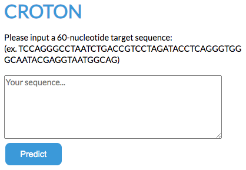

# CROTON
<a id='sec0'></a>
Please follow these instructions to host CROTON on your local computer. Reference this link for more information about CROTON and its capabilities: [Link to Paper]()

### Get the latest code
Clone the Github Repository. If you have a previous version, make sure to pull the latest commits:
```
git clone https://github.com/vli31/CROTON
cd CROTON
git pull
```
If you see `Already up to date` in the terminal, it means the code you have is the latest version.

## Creating an Anaconda microenvironment
To run CROTON, it is easiest to use a conda microenvironment. If you do not have Anaconda, you can download it at this link: https://www.anaconda.com/products/individual. 

The environment used for CROTON is available in this repository in the file 'croton.yml'. It is recommended that you use the same versions of Django (3.0.3), Keras (2.2.4) and TensorFlow (1.14.0).
```
conda env create -f croton.yml
conda activate croton
```

## Setting up django 
To set up django make sure you are in the directory 'CROTON' and have activated the microenvironment 'croton', then run:
```
python manage.py runserver
```
Now CROTON should be avilable at the local host: http://127.0.0.1:8000/

The CROTON web interface should look like this:



## Contact
If you encounter an issues or would like to give any feedback, feel free to leave a [GitHub issue](https://github.com/vli31/CROTON/issues).

[Back to Top](#sec0)